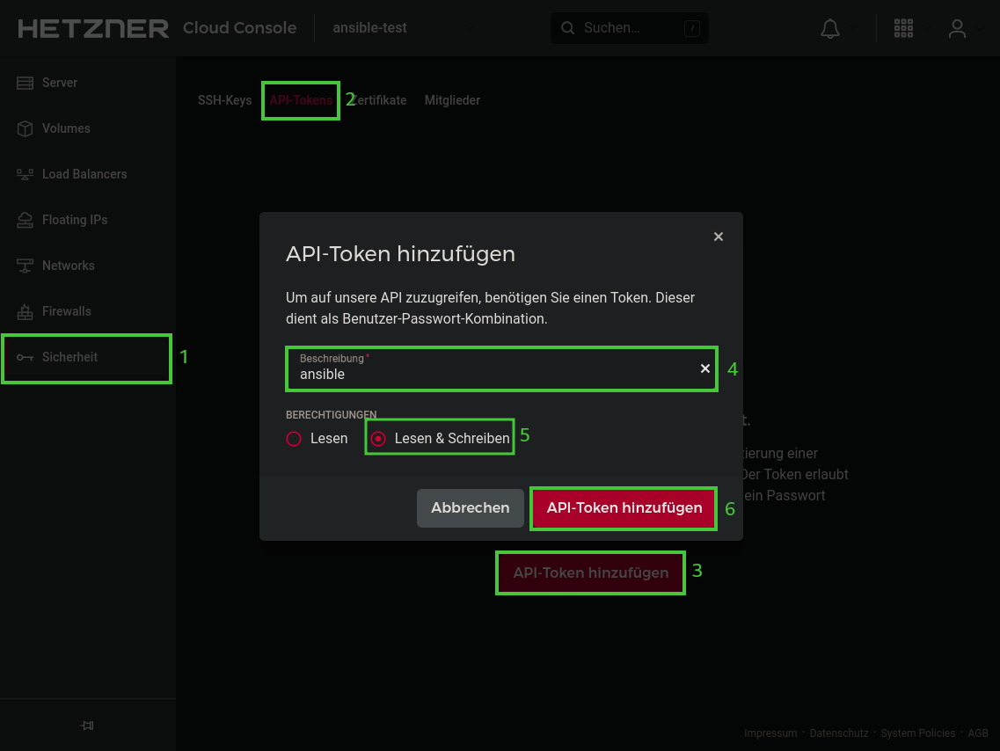

# Secure Shell Networks: [Hetzner Cloud](https://www.hetzner.com/cloud) Ansible Inventory

## Getting started
1. Clone this git repository:
   ```shell
   git clone https://github.com/secshellnet/hcloud-ansible.git
   ```
2. Install the required ansible and python modules:
   ```shell
   ansible-galaxy collection install hetzner.hcloud
   pip3 install ipaddress passlib
   ```
3. Create account on [hetzner.cloud](https://console.hetzner.cloud/)
4. Create new cloud project
5. Create an api token inside this cloud project
   
6. Generate a new secret for the ansible vault file
   ```shell
   cat /dev/urandom | tr -dc A-Za-z0-9 | fold -w 59 | head -n 1 > .keys/all
   ```
7. Create a new ansible vault
   ```shell
   ansible-vault create group_vars/all/vault
   ```
   with the following content:
   ```yaml
   ---
   hcloud_api_token: "__YOUR_API_TOKEN__"
   low_priv_password: "__RANDOM_SECRET_PASSWORD__"
   ```
8. Extend the [`inventory.yaml`](./inventory.yaml), it should look for example like this:
   ```yaml
   ---
   all:
     hosts:
       server1:   # default settings if no configuration given
         server_type: cx11
         location: hel1
         image: ubuntu-22.04
         enable_ipv4: false
         enable_ipv6: true
       server2:
         server_type: cx21
         location: fsn1
         image: ubuntu-22.04
         enable_ipv4: true
         enable_ipv6: true
   ```
9. Use the ansible inventory:
   ```shell
   ansible-playbook playbook.yaml
   ```
10. Create a backup of the [`.keys`](./keys/) directory. It contains the key to your vault and the ssh key ansible uses to connect to the cloud servers. For security reasons this directory is excluded from git operations (see [`.gitignore`](./.gitignore)), so by default it will not be pushed to your git repository!