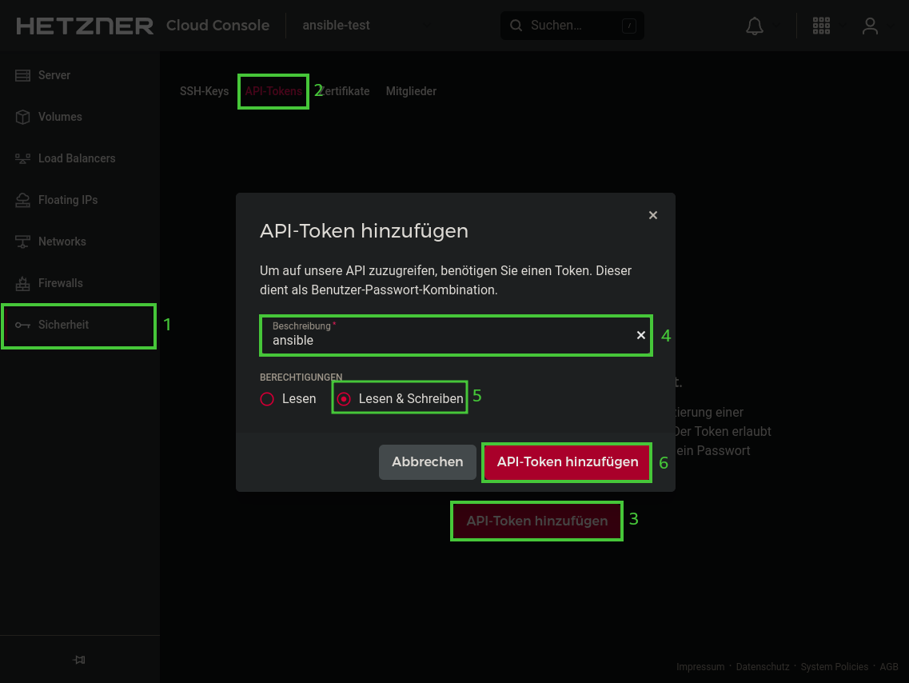

# Secure Shell Networks: [Hetzner Cloud](https://www.hetzner.com/cloud) Ansible Inventory

This repository template provides an ansible inventory to manage cloud server in 
hetzner cloud (hcloud). It performes some basic linux hardening (unattended upgrades, 
ssh, fail2ban, ...) and can be extended by roles or tasks to perform whatever you need.

## Getting started
To use this template, start by creating a repository that inherits from this template. Next 
create an account and a new cloud project on [hetzner.cloud](https://console.hetzner.cloud/).
Generate a password for the ansible vault and store it in `.keys/all`. Afterwards create a new
ansible vault with this password and add the following to it.
```shell
# create random password
cat /dev/urandom | tr -dc A-Za-z0-9 | fold -w 20 | head -n 1 > .keys/all

# create ansible vault using predefined password
ansible-vault create group_vars/all/vault
```

Add a random password for the worker user on the machine and the api token (see image) to the
vault in the following format.


```yaml
---
hcloud_api_token: "__YOUR_API_TOKEN__"
worker_password: "__RANDOM_SECRET_PASSWORD__"
```

Next you need to extend your inventory, for example like this:
```yaml
---
all:
  hosts:
    server1:   # default settings if no configuration given
      server_type: cx23
      location: hel1
      image: ubuntu-24.04
      enable_ipv4: false
      enable_ipv6: true
    server2:
      server_type: cx33
      location: fsn1
      image: debian-13
      enable_ipv4: true
      enable_ipv6: true
```

After you installed the required ansible and python modules you should be able to use the inventory.
```shell
pip3 install ansible ansible-lint
pip3 install -r requirements.txt
ansible-galaxy collection install -r requirements.yaml
ansible-galaxy role install -r requirements.yaml

ansible-playbook playbook.yaml

# you can also limit the playbook to one of your hosts
ansible-playbook playbook.yaml --limit alpha

# tags can be used to run only specific parts of a playbook
ansible-playbook playbook.yaml --list-tasks
ansible-playbook playbook.yaml --limit alpha --tags redis

# to check wether the system picks up the correct variables you can run
ansible-inventory --vars --graph

# make sure to lint your inventory regulary
ansible-lint
```

Make sure to create a backup of the [`.keys`](./keys/) directory. It contains the key to your
vault and the ssh key ansible uses to connect to the cloud servers. For security reasons this
directory is excluded from git operations (see [`.gitignore`](./.gitignore)), so by default it
will not be pushed to your git repository!

## What about GitOps?
I've tried integrating git ops, but there is one problem: the GitHub actions runner does 
not support ipv6... So you need an ipv4 address on each vm to use git ops for now.

Create the following github actions variables and secrets in your repository and make 
sure to commit and push both your `inventory.yaml` and `group_vars/all/vault` file:
- Variable: `ENABLE_GITOPS` to value `1`
- Secret: `SSH_KEY` to content of [`.keys/id_ecdsa`](./keys/id_ecdsa)
- Secret: `ANSIBLE_KEYS_ALL` to the content of [`.keys/all`](./keys/all)

## Structure

Even though the structure is self explaining here are some comments:
```shell
hcloud-ansible
├── .github                      # github actions workflows
│   └── workflows
│       └── gitops.yaml
├── .keys                        # ssh and ansible vault keys
│   ├── all                      # key for ansible vault for group_vars all
│   ├── id_ecdsa
│   └── id_ecdsa.pub
├── ansible.cfg
├── group_vars
│   └── all
│       ├── defaults.yaml
│       ├── vars.yaml            # plaintext global variables
│       └── vault                # encrypted global variables (e. g. hetzner cloud api token)
├── inventory.yaml
├── playbook.yaml
├── roles                        # roles to add functionality to your server
│   └── ansible-role-postgresql
├── ssh
│   └── nicof2000.pub
├── tasks
│   ├── linux
│   │   ├── audit-lynis.yaml
│   │   ├── audit-openscap.yaml
│   │   ├── create-users.yaml
│   │   ├── create-worker-user.yaml
│   │   ├── setup-auditd.yaml
│   │   ├── setup-auto-update.yaml
│   │   ├── setup-clamav.yaml
│   │   ├── setup-fail2ban.yaml
│   │   ├── setup-iptables.yaml
│   │   ├── setup-rkhunter.yaml
│   │   └── setup-sshd.yaml
│   └── local
│       ├── ensure-keys-exists.yaml
│       └── hetzner-cloud.yaml   # task to manage cloud servers and aquire information to connect
└── templates
    ├── auditd.rules.j2
    ├── dnf-automatic.conf.j2
    └── fail2ban-sshd.conf.j2
```

Some examples configurations, e.g. how to use roles, can be
found in the [examples](./docs/EXAMPLES.md) directory.
